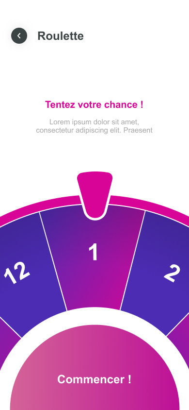

# Spinner Wheel Flutter Package

A Flutter package for creating a spinner wheel with customizable options. This package allows users to spin a wheel and win prizes based on the selected item.

## Installation

Add the following dependency to your `pubspec.yaml` file:

```yaml
dependencies:
  spinner_wheel: ^1.0.0
```

## Usage

Import the package into your code:

```dart
import 'package:spinner_wheel/spinner_wheel.dart';
```

create a 'Spinner' widget

```dart
    Spinner(
  title: "Tentez votre chance !",
  titleColor: Color(0xFFD80497),
  description: "Faites tourner la roue pour tenter d'obtenir d'innombrables cadeaux",
  descriptionColor: Color(0xFFA7A7A7),
  gifts: ["Gift 1", "Gift 2", "Gift 3", ...],
)
```

## Properties

| Property           | Type           | Description                                      | Default                                        |
| ------------------ | -------------- | ------------------------------------------------ | ---------------------------------------------- |
| `title`            | `String`       | The title of the spinner                         | `Take your chances!`                           |
| `titleColor`       | `Color`        | The color of the title                           | `Colors.pink`                                  |
| `description`      | `String`       | The description of the spinner                   | `Spin the wheel to try to get countless gifts` |
| `descriptionColor` | `Color`        | The color of the description                     | `Colors.grey`                                  |
| `gifts`            | `List<String>` | The list of gifts to be displayed on the spinner | `null`                                         |

## Example

```dart
import 'package:flutter/material.dart';
import 'package:spinner_wheel/spinner_wheel.dart';

void main() {
  runApp(MyApp());
}

class MyApp extends StatelessWidget {
  @override
  Widget build(BuildContext context) {
    return MaterialApp(
        home: Scaffold(
      body: Center(
        child: Spinner(
          title: "take your chances !",
          titleColor: Color(0xFFD80497),
          description: "Spin the wheel to try to get countless gifts",
          descriptionColor: Color(0xFFA7A7A7),
          gifts: ["iPhone", "Free Coffee", "T-shirt", "Discount Coupon"],
        ),
      ),
    ));
  }
}

```

## Screenshots



## Future Features

- [ ] Add a custom icon for the spinner
- [ ] Add sound effects
- [ ] Add a custom background image
- [ ] Add a custom win popup

## Contributing

Pull requests are welcome. For major changes, please open an issue first to discuss what you would like to change.

## License

This package is licensed under the [MIT License](https://choosealicense.com/licenses/mit/).
